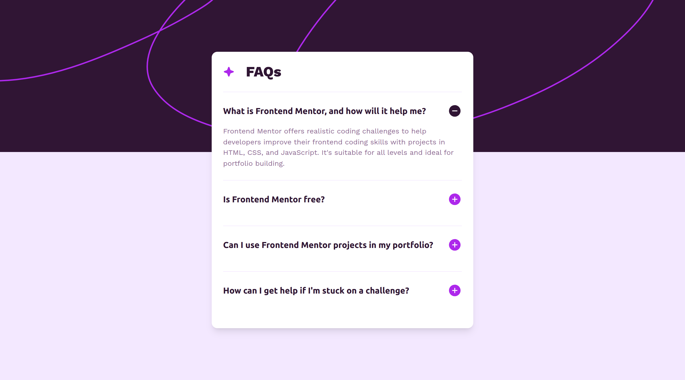

# Frontend Mentor - FAQ accordion solution

This is a solution to the [FAQ accordion challenge on Frontend Mentor](https://www.frontendmentor.io/challenges/faq-accordion-wyfFdeBwBz). Frontend Mentor challenges help you improve your coding skills by building realistic projects.

## Table of contents

- [Overview](#overview)
  - [Screenshot](#screenshot)
  - [Links](#links)
- [My process](#my-process)
  - [Built with](#built-with)
- [Author](#author)

## Overview

### Screenshot

### Links

- Solution URL: [GitHub Repos](https://github.com/MoDev228/faq-accordion-main)
- Live Site URL: [FAQS Accordion](https://g-akca.github.io/faq-accordion-main/)

## My process

### Built with

- Semantic HTML5 markup
- TAILWIND CSS
- CSS
- Flexbox
- Mobile-first workflow

## Author

- GitHub - [@MoDev228](https://github.com/MoDev228)
- Frontend Mentor - [@MoDev228](https://www.frontendmentor.io/profile/MoDev228)
